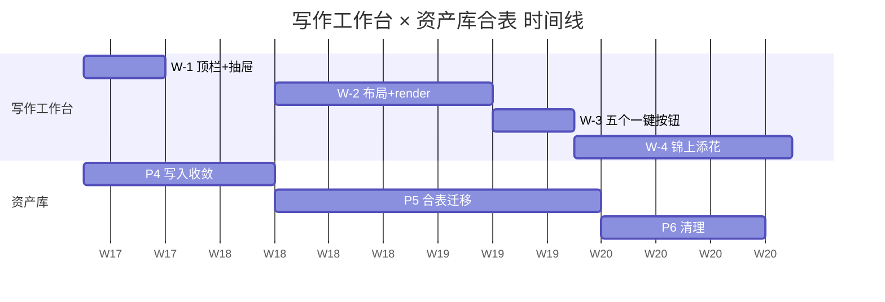

# 写作工作台 × 成书一体化重构规划

> **状态**：规划已就绪，待 W-1 实施
> **创建日期**：2026-04-19
> **产出方式**：Agent team 协同（布局 + 协议 + 卡片 + 一键 + 联动 5 个 Plan agent）
> **关联 memory**：`memory/project_asset_library_refactor.md`
> **前置依赖**：资产库合表 Phase A **P4 写入路径收敛**（W-2 开工前必须完成）

---

## 0. 执行摘要

### 0.1 用户需求

> "'成书'板块、写作 agent 中的功能，应该直接放在主工作台……使用工具调用可以使用内嵌的美化面板，设计大纲、章节。用户尽量可以简单地操作，完成很完整的、功能很丰富的、全面的要求。"

### 0.2 总决策表

| 维度 | 决策 | 依据 |
|---|---|---|
| ViewMode | 4 → 3（删 `book-run`） | 成书进抽屉，不占主屏 |
| Drawer 选型 | 复用现有 `components/ui/sheet.tsx` | 已存在，不引入 vaul |
| 工具返回协议 | `execute_tool` 签名 `str → dict{result, render?}` | 47 个老工具只需兼容层包一层 |
| SSE 事件 | **不新增**，复用 `tool_result` 加 `render` 字段 | 单点注入，向后兼容 |
| 采纳落库路径 | 前端按 `render.type` 分发到已封装 API client | 严禁造新端点 |
| 交互铁则 | 所有 `propose_*` / `rewrite_*` / `manage_*` 仅草拟，点 [采纳] 才落库 | 用户已选 |
| 一键后端架构 | `agent_loop` + 预制 system prompt + 工具白名单，新子目录 `one_click/` | 5 个按钮属短任务，不用状态机 |
| 提案工具分类 | 新建 `_PROPOSE_TOOL_NAMES` 集合，与 `_WRITE_TOOL_NAMES` 分离并允许并行 | 提案只读 DB，不走 SQLite WAL |
| 分期 | W-1（2-3 天）→ W-2（3-5 天）→ W-3（2-3 天）→ W-4（可选） | 先低风险高收益 |
| 与资产库协调 | W-1 独立并行 / W-2 等 P4 / W-3 与 P5 并行 | `_query_entity` 是强冲突点 |

### 0.3 四大交互原则

1. **草拟 + 用户手动采纳**：写入型工具（`propose_*` / `rewrite_*` / `manage_*`）只产出 render 卡片，用户点 [采纳] 才走写路径。
2. **不造新端点**：采纳动作按 `render.type` 分发到已封装 API client（`createScene` / `updateScene` / `updateManuscriptBlock` / `applyReviewer` / `createChapter` / `updateChapter`）。
3. **只读卡片用蓝色定稿态，草拟卡用琥珀虚线**：视觉一眼区分"可直接信任 vs 待你确认"。
4. **成书常驻进度、按需详情**：顶栏 StatusBar 永远可见，详细计划在 ⌘B 抽屉。

### 0.4 分期节奏总览

```
W-1 最小可感        ███                        2-3 天
W-2 布局+协议重写      ████████                3-5 天
W-3 五个一键按钮              ███              2-3 天
W-4 锦上添花                     ████████     可选
```

详见 §5.4 甘特图。

### 0.5 跨章节决策协调（避免实施时踩坑）

- **采纳路径冲突解决**：§3（卡片）与 §4（一键）在"采纳调用哪个端点"上曾有分歧。最终采纳 §3 方案：**前端按 `render.type` 分发到已封装 API client**，不走统一的 `/one-click/apply-card`。Agent D 原稿中提到的 `apply-card` 端点作废。
- **SSE 事件冲突解决**：§2（协议）规定不新增事件类型，复用 `tool_result`。§4（一键）原稿的 `render_card` 独立事件作废，所有 render 走 `tool_result.render`。
- **组件分层约定**：
  - `frontend/src/pages/writer/layout/` — 布局壳子（StatusBar / OutlineTree / BookPlanDrawer / ToolRenderHost / KeyboardShortcutProvider）
  - `frontend/src/pages/writer/components/tool-render/` — 8 张卡片组件
  - `frontend/src/pages/writer/components/tool-render/use-render-adopt.ts` — 共享采纳 hook

---

# 第一部分 · 前端布局重构

## 1.1 目标

把"成书"从独立 ViewMode 降级为右侧 `Sheet` 抽屉（⌘B 触发），主区改为 `ResizablePanelGroup` 双栏：左栏 `OutlineTree`（章节 + 大纲 + 场景合一树形），右栏保持 `SceneEditor` 接管式编辑；顶部新增常驻 `BookRunStatusBar`。

## 1.2 `page.tsx` 区块级改造表

路径：`frontend/src/pages/writer/page.tsx`（当前 1284 行）

| 行号区间 | 当前职责 | 改造动作 | 拆分目标 |
|---|---|---|---|
| 10–49 | 大量子面板 import | 精简；新增 `Sheet / ResizablePanelGroup / ResizablePanel / ResizableHandle` 及 `BookRunStatusBar`、`OutlineTree`、`BookPlanDrawer`、`ToolRenderHost`、`useWriterShortcuts` | 本文件保留 |
| 69–74 | `useRef`、`createChapterOpen` 本地 state | 创建章节 dialog 状态迁移到 `useWriterDialogs` 内聚 hook | `hooks/use-writer-dialogs.ts` |
| 176–186 | `isWriting / isManuscript / isOutline / isBookRun` 派生 | `isBookRun` 分支删除；新增 `drawerOpen`、`activeTool` 读取 | `use-writer-state.ts` |
| 188–197 | 外层 `div.grid` 三栏模板 | 改为 `ResizablePanelGroup` + 顶部 `BookRunStatusBar` 的竖直布局，内部双栏 | `layout/writer-shell.tsx` |
| 200–531 | 左侧 `aside` | 拆为 `OutlineTree` + `ProjectSwitcher`；manuscript TOC 作为 `OutlineTree` 的 `kind` | `layout/outline-tree.tsx` `layout/project-switcher.tsx` |
| 534–567 | main header + Tabs 四标签 | 删除 `<Tabs>`；header 改为章节标题 + 面包屑 + "打开成书抽屉"按钮 | `layout/main-header.tsx` |
| 569–575 | `isBookRun` 分支 | **整段删除**；`BookPlanPanel` + `ForbiddenLexiconPanel` 进 `BookPlanDrawer` | — |
| 577–613 | `isManuscript` / `isOutline` 分支 | 合并到右栏统一渲染树 | `layout/right-pane-router.tsx` |
| 615–914 | 巨型 `isWriting` 分支 | 拆为 `ContextPackCard`、`ManuscriptToolbar`、`DraftSurface`、`AuthorInput` | `writing/` 子目录 |
| 917–1161 | 右侧 debug aside | 迁入 `ToolRenderHost`，保留 `debugCollapsed` 折叠 | `layout/tool-render-host.tsx` |
| 1164–1170 | `PresetEditor` Dialog | 保持原位 | — |
| 1172–1281 | 四个确认 Dialog | 搬到 `useWriterDialogs` 返回的 `<WriterDialogs/>` | `hooks/use-writer-dialogs.tsx` |

**目标**：`page.tsx` 从 1284 行降到 ≤ 200 行，仅做 shell 编排。

## 1.3 `use-writer-state.ts` 状态改动

路径：`frontend/src/pages/writer/use-writer-state.ts`（当前 1586 行）

### 1.3.1 `ViewMode` 收窄（第 69 行）

```typescript
export type ViewMode = "writing" | "outline" | "manuscript";
// book-run 迁到 drawer，不再是 view mode
```

### 1.3.2 新增抽屉 / 快捷键 / 工具壁状态（第 164 行附近）

```typescript
export type DrawerKind = "book-plan" | null;
export type ToolKind = "agent-trace" | "memory-review" | "reviewer" | null;

const [drawerOpen, setDrawerOpen] = useState<DrawerKind>(null);
const [activeTool, setActiveTool] = useState<ToolKind>("agent-trace");
const [outlineTreeCollapsed, setOutlineTreeCollapsed] = useState(false);
```

### 1.3.3 `switchViewMode` 改动（第 1390 行）

删除 `manuscript → loadManuscriptBlocks`、`outline → loadChapterOutline` 的副作用分派，改由新 hook `useViewModeEffects` 监听 `viewMode + chapterId` 变更触发：

```typescript
const switchViewMode = useCallback((mode: ViewMode) => setViewMode(mode), []);
const openDrawer = useCallback((k: DrawerKind) => setDrawerOpen(k), []);
const closeDrawer = useCallback(() => setDrawerOpen(null), []);
```

### 1.3.4 Feature flag 接线

在 hook 顶部读取 `useLayoutV2Enabled()`，当返回 `false` 时仍返回旧 `viewMode`（含 `book-run`）。详见 §1.6。

### 1.3.5 返回值增补（第 1451–1585 行的 return 块）

加 `drawerOpen / openDrawer / closeDrawer / activeTool / setActiveTool / outlineTreeCollapsed / setOutlineTreeCollapsed`。

## 1.4 新建组件详单

所有组件落在 `frontend/src/pages/writer/layout/` 与 `frontend/src/pages/writer/hooks/`。

### 1.4.1 `BookRunStatusBar`

路径：`layout/book-run-status-bar.tsx`

职责：顶部常驻 38 px 高带状条，展示当前 `book_run` 阶段（`PLAN_INIT / RETRIEVE / OUTLINE / CHAPTER_WRITE / WORD_AUDIT / LEXICON_AUDIT / CHAPTER_COMMIT / DONE`）、"草拟中 N/M 章"徽章、SSE 连接状态灯、⌘B 快捷提示。**不独占 SSE 订阅**——它是 `useBookRunStatusStore` 的订阅方（详见 §5.2）。

```typescript
import type { BookRunStage, BookRunChapterRow } from "@/stores/book-run-store";

export interface BookRunStatusBarProps {
  stage: BookRunStage | null;
  chapters: Record<number, BookRunChapterRow>;
  running: boolean;
  lastEventAt: number | null;
  onOpenDrawer: () => void;
  onAbort: () => void;
}
```

### 1.4.2 `OutlineTree`

路径：`layout/outline-tree.tsx`

职责：把"章节 → 场景 → 大纲条目"折叠树列在左栏。选中章节触发 `handleChapterSelectUpdate`；选中场景触发 `handleSceneSelect` 并滚动右栏。manuscript 视图复用 `kind="manuscript"` 形态渲染 `ManuscriptTocPanel` 节点样式。

```typescript
import type { ChapterOption, SceneItem, OutlineScene, ManuscriptChapter, ManuscriptBlockItem } from "../use-writer-state";

export type OutlineTreeKind = "outline" | "manuscript";

export interface OutlineTreeProps {
  kind: OutlineTreeKind;
  chapters: ChapterOption[] | ManuscriptChapter[];
  scenes: SceneItem[];
  outlineByChapter: Record<string, OutlineScene[] | null>;
  blocks?: ManuscriptBlockItem[];
  selectedChapterId: string;
  selectedSceneId: string;
  expandedChapterIds: Set<string>;
  onToggleChapter: (chapterId: string) => void;
  onSelectChapter: (chapterId: string) => void;
  onSelectScene: (sceneId: string) => void;
  onCreateChapter: () => void;
  onDeleteScene: (sceneId: string) => void;
  onMoveBlock?: (blockId: string, targetChapterId: string | null) => void;
}
```

### 1.4.3 `BookPlanDrawer`

路径：`layout/book-plan-drawer.tsx`

职责：`Sheet side="right"`，宽度 `w-[min(720px,60vw)] sm:max-w-none`（必须覆盖默认 `sm:max-w-sm`）。内部竖排 `BookPlanPanel` + `Separator` + `ForbiddenLexiconPanel`。

> **⚠ 关键约束**：组件必须**始终挂载**，靠 `open` 状态控制 `Sheet`，**不能**条件挂载。否则 `BookPlanPanel` 内部的 `abortRef`（`book-plan-panel.tsx:85`）会在 unmount 时被 cleanup 触发 `abortRef.current?.abort()`，SSE 断连。解决方案在 §5.2 抬升 SSE 状态到 Zustand store。

```typescript
export interface BookPlanDrawerProps {
  open: boolean;
  onOpenChange: (open: boolean) => void;
  projectId: string;
}
```

### 1.4.4 `KeyboardShortcutProvider`

路径：`layout/keyboard-shortcut-provider.tsx`

职责：React context，`document.addEventListener("keydown")` 自建（**不引入** `react-hotkeys-hook`，一个依赖就为四个键不划算），通过 `useWriterShortcuts()` 按 `pageId` 过滤避免全局污染。

```typescript
export type ShortcutKey = "mod+b" | "mod+m" | "mod+l" | "mod+k";
export type ShortcutHandler = (e: KeyboardEvent) => void;

export interface ShortcutRegistration {
  key: ShortcutKey;
  handler: ShortcutHandler;
  scope?: "writer" | "global";
  enabled?: boolean;
}

export interface KeyboardShortcutProviderProps {
  children: React.ReactNode;
  scope: "writer";
}

export function useWriterShortcuts(registrations: ShortcutRegistration[]): void;
```

快捷键映射：

- `⌘B / Ctrl+B`：`setDrawerOpen(prev => prev === "book-plan" ? null : "book-plan")`
- `⌘M / Ctrl+M`：`setViewMode("manuscript")`
- `⌘L / Ctrl+L`：`setViewMode("outline")`
- `⌘K / Ctrl+K`：预留指令面板入口（W-4 接 `cmdk@1.1.1`，已在 `package.json`）

### 1.4.5 `ToolRenderHost`

路径：`layout/tool-render-host.tsx`

职责：第三栏可展开区。把原 917–1161 右侧 aside 内的三块（Agent Progress / Agent Timeline / Memory Review + Reviewer）重构为独立 tool，由 `activeTool` 切换；关闭时折成 44 px 竖条（复用原 `debugCollapsed` 视觉）。**同时承担 §3 的 8 张渲染卡片分发职责**。

```typescript
import type { AgentTraceState, DraftPhase, ContextItem } from "../use-writer-state";

export interface ToolDescriptor {
  id: "agent-trace" | "memory-review" | "reviewer";
  label: string;
  icon: React.ComponentType<{ className?: string }>;
  badgeCount?: number;
}

export interface ToolRenderHostProps {
  collapsed: boolean;
  activeTool: "agent-trace" | "memory-review" | "reviewer" | null;
  onToggleCollapsed: () => void;
  onActivate: (id: ToolDescriptor["id"] | null) => void;
  agentTrace: AgentTraceState;
  draftPhase: DraftPhase;
  selectedItem: ContextItem | null;
}
```

### 1.4.6 `useWriterDialogs`

路径：`hooks/use-writer-dialogs.tsx`

聚合四个确认 Dialog，返回 `{ confirmDeleteScene, confirmDeleteBlock, confirmDeleteChapter, openCreateChapter, dialogsNode }`，`page.tsx` 只渲染 `dialogsNode`。

## 1.5 `Sheet` 抽屉使用方式

- **挂载层级**：`BookPlanDrawer` 永远挂在 `WriterPage` 的最外层（当前 `<>...</>` 的 return 根），与四个确认 Dialog 同级。`Sheet` 用 `Portal`，自动渲染到 `document.body`。
- **尺寸覆盖**：`SheetContent` 默认 `w-3/4`、`sm:max-w-sm`。抽屉需 640–720 px，在 `BookPlanDrawer` 内传 `className="w-[min(720px,60vw)] sm:max-w-none"`。
- **与 Dialog 共存**：两者默认 `z-50`（`sheet.tsx:54`、`dialog.tsx:54`）。在抽屉内点"新建成书计划"触发 `PresetEditor` 的 Dialog 可能被盖住。**修复**：`BookPlanDrawer` 的 `SheetContent` 显式 `className="z-40"`，给 Dialog 留 10 层空间；或给 Dialog 专门建 `z-[60]` 工具类。

## 1.6 Feature Flag 机制

### 1.6.1 三重叠加（按优先级低→高）

1. **localStorage 键** `novelwork.writerLayoutV2`（`"true" | "false"`）—— 持久化用户偏好；首次访问读 env `VITE_WRITER_LAYOUT_V2_DEFAULT`（上线前 `"false"`，灰度中切 `"true"`）
2. **URL query** `?layout=v1|v2` —— 会话级覆盖，便于 Bug 排查和演示。读一次但不写回 localStorage
3. **Zustand `writer-layout-store`**（新建，独立于 `layout-store.ts`）—— 运行时唯一真相，`persist` 到 localStorage key

初始化顺序：URL query > localStorage > env 默认。

### 1.6.2 切换 UI 入口

- 顶栏 StatusBar 最右侧"更多"菜单下拉"切换到旧布局"——点击后 `setLayoutVersion("v1")` 并 `window.location.reload()`（组件树差异过大，热切换留脏状态，刷新代价最低）
- v1 旧布局右下角放一个"试用新布局"横幅（仅 Beta 期）
- Debug 快捷键 `⌘+Shift+L` 切换（W-4 与 CommandPalette 一起做）

### 1.6.3 老代码保留期限

**4 周 / 2 个小版本**：

- W-4 完成当周打 v2.1
- 两周后小版本 v2.2 从路由树移除 v1 组件
- 第 3、4 周灰度观测
- 第 4 周末删除 v1 源码

删除前置条件：线上无错误突增；BookPlanPanel / 场景编辑器两路径 P0 工单为零；回退 v1 用户比 < 5%。

## 1.7 双栏布局实现

使用已存在的 `src/components/ui/resizable.tsx`（`react-resizable-panels@4.10.0`）：

- 外层：`<ResizablePanelGroup direction="vertical">` — 上格子 40 px `BookRunStatusBar`（`minSize={0}` + 固定高度包装 `div`），下格子 `<ResizablePanelGroup direction="horizontal">`
- 水平组：
  - `<ResizablePanel defaultSize={26} minSize={14} maxSize={42} id="outline-tree">` 放 `OutlineTree`
  - `<ResizableHandle withHandle>`
  - `<ResizablePanel defaultSize={56} minSize={30}>` 放 `SceneEditor / OutlineView / ManuscriptProseView` router
  - `<ResizablePanel defaultSize={18} minSize={0} collapsible collapsedSize={3}>` 放 `ToolRenderHost`
- **持久化**：监听 `onLayout={(sizes) => ...}`，写 `writer-layout-store`；初始从 store 读取百分比
- **默认宽度**（1440 px 窗口）：左 26% ≈ 374 px；中 56% ≈ 806 px；右 18% ≈ 260 px

## 1.8 潜在陷阱（实施前必读）

### 1.8.1 Z-index / overlay 堆叠
`sheet.tsx` 与 `dialog.tsx` 同为 `z-50`。在抽屉内开 Dialog 可能被盖住。**修复**见 §1.5。

### 1.8.2 SSE 订阅在 drawer 切换时保活
`book-plan-panel.tsx:85` 的 `abortRef` 绑到组件。若条件挂载，`useEffect` cleanup 触发 `abortRef.current?.abort()` 断连。**修复**：把 SSE 状态抬到 `src/stores/book-run-store.ts`（新建 Zustand store，`AbortController` 存 store），`BookRunStatusBar` 和 `BookPlanPanel` 同订阅 store。推荐强烈执行。

### 1.8.3 章节选择状态与大纲树联动
现有 `use-writer-state.ts:599` 的 `loadChapterOutline` 只在 `viewMode === "outline"` 或 `chapterId` 变化时触发。`OutlineTree` 默认展开当前 `chapterId`，需要**预加载所有已展开章节的 outline**。新增 hook `useOutlineBatchLoader(expandedChapterIds)`，批量一次取齐，存 `outlineByChapter: Record<string, OutlineScene[]>`。

### 1.8.4 `handleSceneSelect` 与右栏路由冲突
选场景需先 `setViewMode("writing")` 再 `setSelectedSceneId`；manuscript 模式点 `OutlineTree` 的 block 节点应 `manuscriptProseRef.scrollToChapter`（现有 ref 保留，搬到 `WriterShell`）。

### 1.8.5 React 19 StrictMode 双调用
`use-writer-state.ts:344` 注释提醒 `setAgentTrace` 内不得有副作用。新抽出组件的 `useMemo` 必须纯计算。

### 1.8.6 AppSidebar 自动折叠
`app.tsx:48` 的 `WORKBENCH_PATHS` 包含 `/writer`，进入时自动收 sidebar。用户手动展开 sidebar 同时 ⌘B 打开抽屉，屏幕左右各占一截，中间只剩 800 px 左右——QA Checklist 必写此组合。

---

# 第二部分 · 工具 Render 协议

## 2.1 设计目标与原则

当前 `execute_tool`（`tool_executors.py:79`）返回扁平 `str`，经 `agent_loop.py:209` 的 `tool_result` 事件经 `summary`/`full_result` 推给前端。前端只能 `<pre>` 展示（`agent-trace-panel.tsx:162`）。

本协议在不改 `str` 语义（LLM 读取的文本上下文）前提下，**叠加可选 `render` 字段**携带结构化数据：

- **双通道解耦**：`result` 给 LLM，`render` 给 UI；二者可不一致
- **可选、向后兼容**：老工具返回 `str` 自动包成 `{result, render=None}`
- **不造新端点**：采纳按 `type` 分发到现成 `/api/writer-agent/*` 路由

## 2.2 协议信封

```json
{
  "version": 1,
  "type": "scene_proposal | entity_card | prose_diff | word_budget | chapter_structure_proposal | thread_board | relation_subgraph | scene_timeline",
  "data": { },
  "actions": [
    { "label": "采纳", "endpoint": "POST /api/writer-agent/scenes/xxx", "payload_ref": "data.proposal" }
  ],
  "tool_call_id": "xxx"
}
```

## 2.3 五种主力 type 的 `data` schema

### 2.3.1 `scene_proposal`（草拟场景）

```typescript
{
  chapter_id: string;
  chapter_order: number;
  scene_order: number;
  mode: "insert" | "replace";
  replace_scene_id?: string;
  title: string;
  summary: string;
  pov: string;
  setting?: string;
  characters: string[];
  key_events: string[];
  estimated_word_count?: number;
  rationale?: string;
  related_entities?: string[];
  related_threads?: string[];
}
```

采纳端点：`POST /api/writer-agent/scenes` 或 `PUT /api/writer-agent/scenes/{scene_id}`。

### 2.3.2 `entity_card`（可读/可写）

```typescript
{
  mode: "view" | "propose";
  entity_id: string | null;
  name: string;
  entity_type: "character" | "organization" | "item" | "location" | "skill";
  aliases?: string[];
  tags?: string[];
  summary: string;
  section: "overview" | "profile" | "relations" | "events" | "memories";
  overview?: { core_drive?, surface_mask?, hidden_tension?, current_objective? };
  profile?: { deep_profile_md, values_text?, fears_text?, voice_style?, decision_pattern? };
  relations?: Array<{ other_entity_id, other_name, relation_type, trust_level?, description? }>;
  events?: Array<{ event_id, chapter_order?, event_type, summary }>;
  memories?: Array<{ memory_id, salience, canon, content }>;
  next_cursor?: string;
}
```

采纳端点（mode=propose）：`POST /api/writer-agent/run` 触发 agent `manage_entity(action="create")`。

### 2.3.3 `prose_diff`（改写 diff）

```typescript
{
  scope: "manuscript_block" | "scene";
  target_id: string;
  chapter_label?: string;
  hunks: Array<{
    hunk_id: string;
    original: string;
    replacement: string;
    reason?: string;
    severity?: "high" | "medium" | "low";
    category?: string;
    location_hint?: string;
  }>;
  word_delta?: number;
  source: "reviewer" | "rewrite_span" | "diff_prose";
}
```

采纳端点：`PUT /api/writer-agent/manuscript/block/{block_id}` 或 `POST /api/writer-agent/apply-reviewer`。

### 2.3.4 `word_budget`（只读）

```typescript
{
  chapter_id: string;
  chapter_order: number;
  chapter_title?: string;
  target: number;
  total: number;
  diff: number;
  tolerance_pct?: number;
  blocks: Array<{ block_id, block_order, word_count, preview }>;
  status: "under" | "on_target" | "over";
}
```

无采纳动作（`actions: []`）。

### 2.3.5 `chapter_structure_proposal`（批量章节草拟）

```typescript
{
  plan_id?: string;
  start_chapter_order: number;
  chapters: Array<{
    chapter_order: number;
    title: string;
    summary: string;
    hook?: string;
    word_target: number;
    pov_character?: string;
    key_threads?: string[];
  }>;
  overall_arc?: string;
  rationale?: string;
}
```

采纳端点：`POST /api/writer-agent/chapters/{project_id}` 循环 + `PUT /api/writer-agent/chapters/detail/{chapter_id}`。

## 2.4 Pydantic discriminated union

追加到 `backend/app/schemas/writer_agent_schemas.py` 末尾：

```python
from typing import Annotated, Literal, Union
from pydantic import Field
from ._base import AllowExtraBase


class ToolRenderAction(AllowExtraBase):
    label: str
    endpoint: str
    payload_ref: str = "data"
    confirm: str | None = None
    variant: str | None = None


class _RenderEnvelope(AllowExtraBase):
    version: int = 1
    actions: list[ToolRenderAction] = []
    tool_call_id: str | None = None


class SceneProposalRender(_RenderEnvelope):
    type: Literal["scene_proposal"] = "scene_proposal"
    data: dict

class EntityCardRender(_RenderEnvelope):
    type: Literal["entity_card"] = "entity_card"
    data: dict

class ProseDiffRender(_RenderEnvelope):
    type: Literal["prose_diff"] = "prose_diff"
    data: dict

class WordBudgetRender(_RenderEnvelope):
    type: Literal["word_budget"] = "word_budget"
    data: dict

class ChapterStructureProposalRender(_RenderEnvelope):
    type: Literal["chapter_structure_proposal"] = "chapter_structure_proposal"
    data: dict


ToolRenderPayload = Annotated[
    Union[
        SceneProposalRender, EntityCardRender, ProseDiffRender,
        WordBudgetRender, ChapterStructureProposalRender,
    ],
    Field(discriminator="type"),
]


class ToolExecResult(AllowExtraBase):
    """Executors' dict return shape. `result` is what the LLM sees."""
    result: str
    render: ToolRenderPayload | None = None
```

**设计取舍**：`data` 内部刻意保持 `dict` 而非嵌套 Pydantic 子模型，避免改卡片字段就要同步 10 个类型；前端 TS 类型约束 UI 侧。

## 2.5 `execute_tool` 签名改造

路径：`backend/app/services/writer_agent/tool_executors.py:79`

```python
from typing import TypedDict, NotRequired


class ToolExecResultDict(TypedDict):
    result: str
    render: NotRequired[dict]   # 已序列化的 render payload


def execute_tool(
    tool_name: str,
    tool_input: dict,
    project_id: str,
) -> ToolExecResultDict:
    """Execute a named tool. Always returns a dict; legacy str returns are wrapped."""
    executor = _EXECUTORS.get(tool_name)
    if executor is None:
        return {"result": f"未知工具：{tool_name}"}
    try:
        raw = executor(tool_input, project_id)
    except Exception:
        logger.error("Tool %s execution failed:\n%s", tool_name, traceback.format_exc())
        return {"result": f"工具 {tool_name} 执行出错：{traceback.format_exc()}"}

    # Back-compat: legacy executors still return plain str.
    if isinstance(raw, str):
        return {"result": _truncate_result(raw)}
    # New-style executors return dict with {result, render?}.
    result_text = _truncate_result(raw.get("result", ""))
    out: ToolExecResultDict = {"result": result_text}
    if raw.get("render") is not None:
        out["render"] = raw["render"]   # already a plain dict (model_dump'd)
    return out
```

**约定**：新执行器内部：

```python
return {
    "result": "...",   # LLM 文本
    "render": SceneProposalRender(
        type="scene_proposal",
        data={...},
        actions=[ToolRenderAction(label="采纳", endpoint="POST /api/writer-agent/scenes", payload_ref="data")],
        tool_call_id=tool_input.get("_call_id"),
    ).model_dump(mode="json"),
}
```

截断只对 `result` 应用，不截 `render`（前端要完整结构）。

## 2.6 `agent_loop.py` tool_result 改造

路径：`backend/app/services/writer_agent/agent_loop.py:209-218`

**决策**：不新增 `tool_render` 事件类型。理由：

1. `tool_call` 和 `tool_result` 的配对已靠 `round + name` 绑定，再加事件会让前端 merge 逻辑复杂化
2. SSE 通道可能乱序，合在同一事件里语义最强
3. render 本身已受 payload 大小约束，额外事件拆分无收益

关键改动点：

```python
# _run_tool_sync 解构
ret = execute_tool(tool_name_inner, tool_input_inner, self.project_id)
result_text = ret["result"]
render = ret.get("render")   # dict | None
return tc_inner, tool_name_inner, result_text, render, "ok", elapsed

# 追加 tool message 时只用 result_text（LLM 不该看 render JSON，会污染 token）
self.messages.append({
    "role": "tool",
    "tool_call_id": tc.id,
    "content": result_text,
})

# yield 事件时加 render 字段
yield {
    "type": "tool_result",
    **self._stamp(),
    "round": round_num,
    "name": resolved_name,
    "summary": summary,
    "full_result": result,
    "render": render,            # ★ 新增，None 时前端忽略
    "status": status,
    "tool_elapsed_ms": tool_ms,
}
```

## 2.7 前端 TS 类型与类型守卫

追加到 `frontend/src/types/writer.ts`：

```typescript
export type ToolRenderType =
  | "scene_proposal" | "chapter_structure_proposal"
  | "entity_card"   | "prose_diff"
  | "word_budget"   | "thread_board"
  | "relation_subgraph" | "scene_timeline";

export interface ToolRenderAction {
  kind?: string;                // 可选，优先级低于 endpoint 分发
  label: string;
  endpoint: string;             // 仅供调试展示，前端不直接 fetch
  payload_ref?: string;
  confirm?: string;
  variant?: "primary" | "secondary" | "destructive" | "ghost";
}

export interface ToolRenderBase<T extends ToolRenderType, D> {
  version: 1;
  type: T;
  data: D;
  actions: ToolRenderAction[];
  tool_call_id?: string;
}

// （SceneProposalData / EntityCardData / ProseDiffData / WordBudgetData /
//  ChapterStructureProposalData 的接口见 §3 各卡片章节）

export type ToolRenderPayload =
  | ToolRenderBase<"scene_proposal", SceneProposalData>
  | ToolRenderBase<"entity_card", EntityCardData>
  | ToolRenderBase<"prose_diff", ProseDiffData>
  | ToolRenderBase<"word_budget", WordBudgetData>
  | ToolRenderBase<"chapter_structure_proposal", ChapterStructureProposalData>;

// 类型守卫
export function isRender<T extends ToolRenderType>(
  payload: unknown, type: T,
): payload is Extract<ToolRenderPayload, { type: T }> {
  return !!payload
    && typeof payload === "object"
    && (payload as { type?: unknown }).type === type;
}
```

## 2.8 SSE 消费路径

- **`frontend/src/api/sse.ts` 不需要改**——`SSEEvent = Record<string, unknown>` 已把未知字段原样透传
- **改动点 1**：`use-writer-state.ts:416-431` 的 `tool_result` 分支，给 `AgentToolCall` 多塞 `render` 字段
- **改动点 2**：`agent-trace-panel.tsx:20-26` 的 `AgentToolCall` 接口加 `render?: ToolRenderPayload`
- **挂载点**：`ToolCallItem`（`agent-trace-panel.tsx:124-171`）展开区——当前 `<pre>{tc.fullResult}</pre>`。新增分支：若 `tc.render` 存在，通过守卫分发到 §3 的渲染组件；否则走 `<pre>`

## 2.9 采纳动作回流（不造新端点）

所有"采纳"按钮复用 `@/api/writer-agent` 里已有函数。**严禁** 新建聚合端点。

| 卡片 type | 采纳调用 |
|---|---|
| `scene_proposal` (insert) | `createScene(chapterId, { scene_order, title, summary, pov, key_events })` |
| `scene_proposal` (replace) | `updateScene(replace_scene_id, { title, summary, pov, key_events })` |
| `entity_card` (propose) | `POST /api/writer-agent/run` 传 `task_type="manage_entity"`，由 agent 内部 `manage_entity(action="create")` 落库 |
| `prose_diff` (reviewer) | `applyReviewer` → `POST /api/writer-agent/apply-reviewer` |
| `prose_diff` (rewrite_span) | `updateManuscriptBlock` → `PUT /manuscript/block/{block_id}` |
| `chapter_structure_proposal` | `createChapter` + `updateChapter` 循环 |
| `word_budget` | 无采纳 |

**`actions.endpoint` 只做"提示"**：前端不直接 `fetch(endpoint)`，按 `type` 分发到封装的 API client 函数。未来改路由只改 client 不改工具 render。

## 2.10 版本化与降级

`version: int = 1` 字段由后端写入，前端检查：

- **新前端 / 老后端**：`event.render === undefined` → 走原有 `<pre>` 展示，用户无感
- **老前端 / 新后端**：前端忽略 `render` 字段（`SSEEvent` 是 `Record<string, unknown>`，不会报错）
- **版本漂移**：`render.version > 1` → 降级渲染 `type + data.summary` 占位并提示升级；`fullResult` 总是可见
- **Schema drift**：`data` 新增字段（additive）无需 bump；删除/改名必须 bump 到 `version: 2`，前端按版本号切代码路径

降级兜底集中在 `ToolCallItem`：

```typescript
if (tc.render && tc.render.version === 1) {
  return <RenderCard />;
} else if (tc.render) {
  return <UnknownRenderFallback />;
} else {
  return <pre>{tc.fullResult}</pre>;
}
```

---

# 第三部分 · 内嵌渲染卡片 UI

## 3.1 顶层分发：`<ToolRenderHost>`

### 3.1.1 职责划分

`ToolRenderHost` 是 `agent-trace-panel.tsx` 中 `ToolCallItem` 展开区的替代节点。当 `tc.render` 存在且 `version === 1` 时渲染本组件，否则回退到 `<pre>`。

```
┌─ ToolCallItem (agent-trace-panel.tsx)
│  ├─ [点开箭头]
│  └─ ToolRenderHost {
│       payload: ToolRenderPayload,
│       projectId, chapterId, sceneId,
│       onAdopted(type, apiResult)      // 成功回调，驱动 writer-state refetch
│     }
│     └─ switch(payload.type) → 8 个子组件
└─
```

### 3.1.2 分发表

| `type` | 子组件 |
|---|---|
| `scene_proposal` | `<SceneProposalCard>` |
| `chapter_structure_proposal` | `<ChapterStructureProposalCard>` |
| `entity_card` | `<EntityCard>` |
| `prose_diff` | `<ProseDiffView>` |
| `word_budget` | `<WordBudgetGauge>` |
| `thread_board` | `<ThreadBoard>` |
| `relation_subgraph` | `<RelationSubgraph>` |
| `scene_timeline` | `<SceneTimeline>` |
| _unknown_ | `<pre>` fallback + 告警 Badge |

### 3.1.3 共享基建

- `components/tool-render/use-render-adopt.ts` — 统一 `adopting | adopted | error` 三态，封装 `toast.success/error`，成功后把卡片 DOM 切到"已采纳"样式
- `components/tool-render/types.ts` — 集中 TS `ToolRenderPayload` 及 8 种 data schema

## 3.2 `SceneProposalCard`

### 3.2.1 触发与场景
工具 `propose_outline_scene`。Agent 草拟新场景（或替换现有），**未入库**。

### 3.2.2 `data` 字段（见 §2.3.1）

### 3.2.3 `actions` 列表

| kind | label | API client | 参数 |
|---|---|---|---|
| `adopt_insert` | `[采纳为新场景]` | `createScene` | `(chapterId, { scene_order, title, summary, pov, key_events })` |
| `adopt_replace` | `[采纳，替换原场景]` | `updateScene` | `(replace_scene_id, { title, summary, pov, key_events })` |
| `edit` | `[编辑后再采纳]` | 无 API — 进本地编辑态 | — |
| `dismiss` | `[忽略]` | 无 API — 隐藏本卡片 | — |

### 3.2.4 ASCII Mockup

```
┌─────────────────────────────────────────────────────┐
│ [草拟] 第 3 章 · 场景 #4 (新增)           ⋯ [×]    │
├─────────────────────────────────────────────────────┤
│ 标题  │ 雪夜对饮                                    │
│ POV   │ 沈观竹  ◉ 替换: #2 初遇                     │
│ 概述  │ 两人在酒肆对坐，围绕玉简残片起冲突。        │
│                                                     │
│ 关键事件 (3):                                       │
│   · 沈观竹拒绝交出残片                              │
│   · 裴昭出示契约卷宗                                │
│   · 店外脚步声中断对谈                              │
│                                                     │
│ 涉及:  [沈观竹] [裴昭]    伏笔: [玉简残片]          │
│ 预估:  ~1800 字   · 理由: 补齐第 2 场遗留的冲突钩子 │
├─────────────────────────────────────────────────────┤
│ [采纳为新场景]  [编辑后再采纳]       [忽略]         │
└─────────────────────────────────────────────────────┘
```

### 3.2.5 组件骨架
文件：`components/tool-render/scene-proposal-card.tsx`

```typescript
interface SceneProposalCardProps {
  data: SceneProposalData;
  actions: ToolRenderAction[];
  projectId: string;
  onAdopted: (result: { scene_id: string }) => void;
}
```

### 3.2.6 复用 shadcn
`Card`, `CardHeader`, `CardContent`, `CardFooter`, `Badge`, `Button`, `Separator`, `Tooltip`, `Collapsible`。

## 3.3 `ChapterStructureProposalCard`

### 3.3.1 触发与场景
工具 `propose_chapter_structure`。Agent 批量草拟多章骨架。

### 3.3.2 `data` 字段（见 §2.3.5）

### 3.3.3 `actions`

| kind | label | API client | 参数 |
|---|---|---|---|
| `adopt_all` | `[全部采纳]` | `createChapter × N` | `(projectId, { chapter_order, title, summary, hook, word_target })` × N |
| `adopt_selected` | `[采纳勾选的 N 章]` | `createChapter × selected` | 同上 |
| `dismiss` | `[忽略]` | 无 | — |

**局部状态**：每行前 `Checkbox`，默认全选。按钮 label 随 selected count 动态变化。

### 3.3.4 Mockup

```
┌──────────────────────────────────────────────────────┐
│ [草拟] 章节结构提案 · 共 5 章 (第 8-12 章)   [×]    │
│ 主弧线: 主角从被动躲藏转向主动揭穿真相               │
├──────────────────────────────────────────────────────┤
│ ☑ Ch.8  风起南境       目标 3200字                   │
│        [守城 + 密信] 钩子: 密信落入敌手               │
│ ──────────────────────────────────────               │
│ ☑ Ch.9  双面密使       目标 3000字                   │
│        [叛徒] 钩子: 身边人是内鬼                     │
│ ──────────────────────────────────────               │
│ ☑ Ch.10 破局          目标 3500字                    │
│ ☑ Ch.11 旧伤          目标 2800字                    │
│ ☐ Ch.12 潜伏          目标 3200字                    │
├──────────────────────────────────────────────────────┤
│  采纳: 4 / 5  |  [全部采纳]  [仅采纳勾选]  [忽略]   │
└──────────────────────────────────────────────────────┘
```

### 3.3.5 文件
`components/tool-render/chapter-structure-proposal-card.tsx`

## 3.4 `EntityCard`

### 3.4.1 触发与场景
工具 `query_entity`（section = overview/profile/relations/events/memories）。**只读**，用于把"长 JSON 块"变成可视化档案。

### 3.4.2 `data` 字段（见 §2.3.2）

### 3.4.3 `actions`（只读，无采纳）

| kind | label | 行为 |
|---|---|---|
| `load_more` | `[加载更多]` | 再调 `query_entity` 带 `cursor`，本地 append |
| `open_in_inspector` | `[在故事图谱中查看]` | `navigate("/story-graph?focus=<entity_id>")` |
| `switch_section` | Tab 切换 | 重新请求工具或本地缓存 |

### 3.4.4 Mockup

```
┌──────────────────────────────────────────────────────┐
│ [沈观竹] character · #SG-01  [只读]     [→ 图谱]    │
│ 别名: 观竹 / 沈郎 / 青衫客   标签: 主角 寡言 剑士   │
├──────────────────────────────────────────────────────┤
│ [概览] [档案] [关系] [事件] [记忆]                   │
├──────────────────────────────────────────────────────┤
│ 核心驱动 │ 为师门的冤屈昭雪                           │
│ 表面     │ 放浪江湖的散人                             │
│ 内在矛盾 │ 复仇 ↔ 不愿落入恩师的老路                  │
│ 当前目标 │ 找到第二枚玉简                             │
│                                                      │
│ 简介:                                                │
│   沈观竹，本名沈清源，青崖剑派遗孤...                │
└──────────────────────────────────────────────────────┘
```

### 3.4.5 视觉
**只读蓝色定稿态**：`border-blue-500/20 bg-blue-500/5`，右上 `<Badge variant="secondary">只读</Badge>`，与草拟琥珀色形成对比。

## 3.5 `ProseDiffView`

### 3.5.1 触发
工具 `diff_prose` / `rewrite_span`，或 `writer_reviewer` 返回。支持"部分接受"。

### 3.5.2 `data` 字段（见 §2.3.3）

### 3.5.3 `actions`

| kind | label | API client | 参数 |
|---|---|---|---|
| `adopt_all` | `[全部采纳]` | scope=manuscript_block → `updateManuscriptBlock`；scope=scene → `updateScene`；source=reviewer → `applyReviewer` | 合成后文本 |
| `adopt_selected` | `[采纳 N/K 项]` | 同上，前端先按 selected hunk_ids 合成 new_content | 同上 |
| `reject_all` | `[全部拒绝]` | 无 API | 卡片折叠 |

### 3.5.4 Mockup

```
┌──────────────────────────────────────────────────────┐
│ [草拟] 改写建议 · 块 #blk-42  第 3 章 · 第 2 段      │
│ 来源: reviewer  字数变化: −48                        │
├──────────────────────────────────────────────────────┤
│ ☑ Hunk 1 [高] cliche · 第 2 段开头                   │
│   ─ 他心如刀绞，泪水夺眶而出                         │
│   + 他把杯底一仰，指节在桌沿压出白痕                 │
│   理由: 替换陈词滥调，改用动作描写                   │
│ ────────────────────────────────────                 │
│ ☑ Hunk 2 [中] pacing · 第 3 段                       │
│   ─ 于是他们缓缓走向城门，一路说着话                 │
│   + 他们走向城门。                                   │
│   理由: 压缩过渡段，交给下段冲突                     │
│ ────────────────────────────────────                 │
│ ☐ Hunk 3 [低] voice · 第 4 段末                      │
│   ─ 月亮像一枚银币                                   │
│   + 月亮斜挂，照不亮巷口                             │
│   理由: 避免比喻过密                                 │
├──────────────────────────────────────────────────────┤
│ 已选 2/3 · [采纳 2 项]  [全部采纳]  [全部拒绝]       │
└──────────────────────────────────────────────────────┘
```

### 3.5.5 复杂局部状态（唯一）
`const [selected, setSelected] = useState<Set<string>>(默认所有 severity=high 勾上)`——复刻 `reviewer-panel.tsx` 的默认选择逻辑。**这是 8 张卡片里唯一有复杂多选 state 的。**

### 3.5.6 视觉
- 整卡 `border-dashed border-amber-500/50`
- 已采纳 hunk 行：`bg-green-500/10` + 前置打勾 + "已采纳"Badge，不可再次勾选
- 全部采纳后：卡片切换为 `bg-muted/40` + Badge `已采纳 · 3/3`
- 行内 diff：`−` 用 `text-muted-foreground line-through decoration-red-400/60`；`+` 用 `text-foreground font-medium` + `border-l-2 border-green-500/60`

## 3.6 `WordBudgetGauge`

### 3.6.1 触发与字段（见 §2.3.4）

### 3.6.2 `actions`

| kind | label | 行为 |
|---|---|---|
| `request_expand` | `[让 Agent 扩写]` | prepend `"请将本章扩写 ~{deficit} 字..."` 到输入框 |
| `request_trim` | `[让 Agent 精简]` | 同上 |
| `jump_to_block` | 每行右侧 `→` | 调父级 `onJumpToBlock(block_id)` 滚动稿件抽屉 |

### 3.6.3 Mockup

```
┌──────────────────────────────────────────────────────┐
│ 字数预算 · 第 3 章 · 雪夜对饮                 [只读] │
├──────────────────────────────────────────────────────┤
│ 目标  3200     当前  3487   差值 +287 (+9.0%)        │
│                                                      │
│  0 ──────────████████████████████████──── 3200  3487 │
│                                       ↑ 容差上限     │
│ 状态: [超出] 已接近上限，建议略微精简                │
│                                                      │
│ 段落明细 (5):                                        │
│  #1 · 412字 · "雪落在城楼上时..."              →    │
│  #2 · 580字 · "沈观竹推开酒肆的门..."          →    │
│  #3 · 1200字 · "裴昭抬眼，笑..."               →    │
├──────────────────────────────────────────────────────┤
│            [让 Agent 扩写]   [让 Agent 精简]         │
└──────────────────────────────────────────────────────┘
```

### 3.6.4 视觉
状态色：`on_target → border-green` / `under → border-blue` / `over → border-red`（仅当超容差）。

## 3.7 `ThreadBoard`

### 3.7.1 `data`

```typescript
{
  scope: "project" | "up_to_chapter";
  up_to_chapter_order?: number;
  threads: Array<{
    thread_id: string;
    thread_key: string;
    status: "open" | "progressed" | "resolved";
    detail: string;
    opened_chapter?: number;
    last_touched_chapter?: number;
    resolved_chapter?: number;
    resolution_detail?: string;
    related_entities?: string[];
    age_chapters?: number;
  }>;
  staleness_threshold?: number;
}
```

### 3.7.2 `actions`

| kind | label | 行为 |
|---|---|---|
| `focus_thread` | 点卡片 → 侧边展开详情 | 本地状态 |
| `request_progress` | `[推进]` | prepend `"请推进伏笔 {thread_key}"` 到输入框，让 Agent 再跑一次 |
| `request_resolve` | `[解决]` | 同上 |

> **注意**：遵循"严禁新端点"，`manage_thread` 是写入工具——前端卡片**不直接写**，而是让 Agent 再跑一次 `manage_thread` 返回 `EntityCard` 风格的确认卡。

### 3.7.3 Mockup

```
┌──────────────────────────────────────────────────────┐
│ 伏笔看板 · 截至第 7 章 · 共 11 条             [只读] │
├──────────────────────────────────────────────────────┤
│  ◇ Open (5)       │ ◆ Progressed (4) │ ● Resolved(2)│
├────────────────────┼──────────────────┼──────────────┤
│ • 玉简残片         │ • 青崖剑派覆灭   │ • 密函出处   │
│   第2章开启        │   第5章推进      │   第6章解决  │
│   [推进][解决]     │   龄: 2章        │              │
│ ────────────────   │ ─────────────── │ ───────────  │
│ • 裴昭的契约       │ • 沈父遗信       │ • 盗玉者     │
│   龄: 4章 ⚠️陈旧   │   龄: 1章        │              │
├──────────────────────────────────────────────────────┤
│ 图例: 龄 = 距上次推进的章节数 · ⚠️ = 超过阈值        │
└──────────────────────────────────────────────────────┘
```

## 3.8 `RelationSubgraph`

### 3.8.1 `data`

```typescript
{
  focus_entity_ids: string[];
  depth: 1 | 2;
  nodes: Array<{
    entity_id: string;
    name: string;
    entity_type: "character" | "organization" | "item" | "location" | "skill";
    tags?: string[];
    is_focus: boolean;
  }>;
  edges: Array<{
    edge_id: string;
    source_id: string;
    target_id: string;
    relation_type: string;
    trust_level?: number;
    is_candidate: boolean;
    description?: string;
  }>;
  stats: { node_count: number; edge_count: number };
}
```

### 3.8.2 实现
复用 `frontend/src/pages/story-graph/graph-render-model.ts` 布局函数 + `graph-view-model.ts` 数据映射，套更小 SVG viewport。

### 3.8.3 Mockup

```
┌──────────────────────────────────────────────────────┐
│ 关系子图 · 焦点: 沈观竹 · 深度 2 · 6节点/7边  [只读] │
│                                                      │
│        ┌─(师徒)──┐                                   │
│   [沈父]──────[沈观竹]◉──(敌对,0.2)──[裴昭]          │
│                │                           │         │
│             (同门)                      (雇主)       │
│                │                           │         │
│           [青崖剑派]              [北境守备府]       │
│                                            ║候选║    │
│                                      [不明长官]      │
│                                                      │
│ 图例: 实线=正典  ─ ═ =候选关系  ◉=焦点               │
└──────────────────────────────────────────────────────┘
```

## 3.9 `SceneTimeline`

### 3.9.1 `data`

```typescript
{
  mode: "chapter" | "character" | "branch";
  title: string;
  axis: "scene_order" | "chapter_order" | "step";
  events: Array<{
    event_id: string;
    axis_value: number;
    label: string;
    subtitle?: string;
    event_type?: "scene" | "action" | "state_change" | "knowledge" | "emotional" | "branch_step";
    highlight?: boolean;
    related_entity_id?: string;
    related_thread_key?: string;
  }>;
}
```

### 3.9.2 `actions`

| kind | label | 行为 |
|---|---|---|
| `open_scene` | 点场景节点 | 调父级 `onOpenScene(scene_id)` |
| `open_entity` | 点角色 chip | 调父级 `onOpenEntity(entity_id)` |
| `open_thread` | 点伏笔 chip | 滚动到 `ThreadBoard` 对应条目 |
| `export` | `[复制为 Markdown]` | 写剪贴板 |

### 3.9.3 Mockup

```
┌──────────────────────────────────────────────────────┐
│ 场景时间线 · 第 3 章 雪夜对饮 · 4 个场景        [只读]│
├──────────────────────────────────────────────────────┤
│                                                      │
│  #1 ●──── 守城日常                                   │
│  │        POV: 沈观竹 · 420 字                       │
│  │                                                   │
│  #2 ●──── 初遇裴昭   ★                               │
│  │        POV: 沈观竹 · 650 字 · [玉简残片]          │
│  │                                                   │
│  #3 ●──── 雪夜对饮                                   │
│  │        POV: 沈观竹 · 1200 字 · [裴昭]             │
│  │                                                   │
│  #4 ●──── 密函出现   ★                               │
│           POV: 裴昭 · 695 字 · [密函出处]            │
└──────────────────────────────────────────────────────┘
```

## 3.10 局部状态需求汇总

| 卡片 | 需要本地 state？ | state 形状 |
|---|---|---|
| SceneProposalCard | 仅"编辑后再采纳" | `{ editing: boolean; draft: SceneProposalData }` |
| ChapterStructureProposalCard | **是** | `Set<chapter_order>` |
| EntityCard | section tab 切换 | `{ activeSection, cachedByCursor: Map }` |
| ProseDiffView | **是（复杂）** | `Set<hunk_id>`，默认 high 自动勾 |
| WordBudgetGauge | 无 | — |
| ThreadBoard | 仅展开详情 | `focusedThreadId?: string` |
| RelationSubgraph | hover/select | `hoveredNodeId?: string` |
| SceneTimeline | 无 | — |

## 3.11 采纳后卡片视觉变化统一规范

| 阶段 | 外观变化 |
|---|---|
| 草拟中（初始） | 虚线琥珀边框 + 左 3px 琥珀条 + `[草拟]` Badge |
| 采纳中（loading） | 按钮 `disabled + <Loader2 animate-spin>`；其他区禁用点击 |
| 部分采纳成功 | 已采纳行 `bg-green-500/10` + ✓ 图标；卡片保持草拟态直到全采纳或关闭 |
| 全部采纳成功 | 切为定稿态：`border-muted bg-muted/40`；右上 `<Badge>已采纳 · 3/3</Badge>`；按钮区替换为 `[已完成，点击展开结果]`；**不自动消失** |
| 忽略 | 折叠为单行 `"已忽略: <title>" + [恢复]`，30 秒后彻底消失 |
| 采纳失败 | 顶部挂 `<Alert variant="destructive">`；按钮恢复可点；Toast 同步提示 |

只读卡（EntityCard / WordBudgetGauge / ThreadBoard / RelationSubgraph / SceneTimeline）不需要上述状态机，保持蓝色定稿态。

---

# 第四部分 · 一键化 Agent 工作流

## 4.1 后端架构选型

**推荐**：混合方案 —— 单章节级编排做轻量状态机，单轮工具调用复用 `agent_loop.py`。

落地目录：

```
backend/app/services/writer_agent/one_click/
├── __init__.py
├── base.py                   # OneClickRunner 基类
├── outline_completer.py      # 🪄 一键补全大纲
├── chapter_continuer.py      # ✍️ 一键续写本章
├── word_aligner.py           # 📐 一键对齐字数
├── lexicon_cleaner.py        # 🚫 一键扫禁词
├── relationship_filler.py    # 🔗 一键补关系
└── proposal_cards.py         # render 卡片序列化器
```

`OneClickRunner` 基类提供 `_run_agent_loop(system_prompt, tools, user_msg, max_rounds)` 封装一次 `AgentLoop.run()`，拦截 `tool_result` 事件，遇到 `propose_*` 工具就序列化为 render 卡片透传。

## 4.2 `_PROPOSE_TOOL_NAMES` 集合（关键优化）

**决策**：新增集合而非扩展 `_WRITE_TOOL_NAMES`。`propose_*` 工具只读 DB + 组装 render payload，**不走 SQLite WAL 写路径**，允许并行加速。

位置：`backend/app/services/writer_agent/agent_loop.py:19-29` 下方：

```python
_PROPOSE_TOOL_NAMES = {
    "propose_outline_scene",
    "propose_rewrite_span",
    "propose_relationship",
    "propose_prose_continuation",
    "propose_splice_block",
}
```

`_WRITE_TOOL_NAMES` 不变。读工具并行规则保持现状。

## 4.3 续写"流式 token + 终态卡片"双轨

- 续写期间：走 `writer_token` 事件（`orchestrator.py:358` 已有约定），用户看到正文实时生成
- 生成完成：后端组装 `ProseContinuationCard` 并作为 `tool_result.render` 发射（遵循 §2 协议，**不新增** `render_card` 事件）
- 用户点"采纳"：前端调现有 `POST /api/writer-agent/manuscript/{project_id}/commit`

## 4.4 五个按钮详细工作流

### 4.4.1 🪄 一键补全大纲

**UI 触发位置**：写作台章节大纲面板右上角，紧挨"生成大纲/重新生成"左侧。定位："在已有大纲中找漏洞补齐"，避免覆盖用户已编辑段落。

**系统提示词**

```
你是小说写作 agent 的「大纲补全助手」。当前章节已有部分 scene/beat，但存在断裂或
缺失（如 POV 切换没过渡、悬念抛出后无承接、关键角色登场前无铺垫）。你的唯一任务：
扫描现有大纲和前后章节的连接点，识别缺口，通过 propose_outline_scene 工具为每个
缺口产出一个 SceneProposalCard 提案。

强制规则：
1. 严禁直接调用 manage_* / splice_block / 任何写工具，你只能提案。
2. 先调用 query_chapter(本章) + query_chapter(前一章) + query_chapter(后一章)
   + get_open_threads 摸清现状，再识别缺口。
3. 每个缺口最多生成 1 个 SceneProposalCard；总提案数不超过 6。
4. 缺口判定：场景 A 和 B 之间 POV 跳变但无过渡、悬念抛出 3 个场景仍未推进、
   新角色无登场铺垫、章节字数目标差异显著。
5. 每张卡必须含 insert_after_scene_order / reason / target_word_count。
```

**工具白名单**
- 读：`query_chapter`、`query_scene`、`get_open_threads`、`get_story_overview`、`query_entity`、`search_settings`、`global_search`、`query_segment_summaries`
- 新增：`propose_outline_scene`
- **禁用**：所有 `manage_*`、`splice_block`、`rewrite_span`

**期望工具链**
```
Step 1: query_chapter(chapter_order=N)
Step 2: query_chapter(N-1) + query_chapter(N+1)        # 并行
Step 3: get_open_threads(up_to_chapter=N)
Step 4: [可选] query_entity(pov_name, section='overview')
Step 5: [识别缺口 — LLM 自主推理]
Step 6..K: propose_outline_scene(...)
Step K+1: brief_ready（输出 scan_summary）
```

**失败处理**
- `MAX_ROUNDS = 8`
- LLM 崩溃：发 `error` 提前落 `done`
- 无缺口：LLM 输出 `{"verdict":"no_gap"}` 结束
- 超时：30 秒硬上限

**新增工具 `propose_outline_scene`**
```json
{
  "name": "propose_outline_scene",
  "description": "为当前章节的大纲缺口生成一个 SceneProposalCard（不落库，等用户采纳）。",
  "parameters": {
    "type": "object",
    "properties": {
      "chapter_id": {"type": "string"},
      "insert_after_scene_order": {"type": "integer"},
      "scene_order": {"type": "integer"},
      "title": {"type": "string"},
      "summary": {"type": "string"},
      "pov": {"type": "string"},
      "key_events": {"type": "array", "items": {"type": "string"}},
      "target_word_count": {"type": "integer"},
      "reason": {"type": "string"}
    },
    "required": ["chapter_id", "insert_after_scene_order", "title", "summary", "reason"]
  }
}
```

**API**：`POST /api/writer-agent/one-click/complete-outline` body `{project_id, chapter_id, chapter_order}`

### 4.4.2 ✍️ 一键续写本章

**UI 触发位置**：写作台底部写作输入区"一键续写"按钮（现有"开始创作"左侧）。零输入，以章尾为锚点生成 400–800 字衔接段。

**系统提示词**

```
你是小说写作 agent 的「章尾续写助手」。用户希望从当前章节最后一块 manuscript 的
末尾自然衔接一段 400–800 字的正文。你不直接写正文（写作由外层 WriterComposer 完成），
你的任务是检索设定、生成 writing_brief，然后只调一次 propose_prose_continuation
封装衔接位置。

执行顺序（必须）：
1. 调 get_manuscript_context(token_budget=6000) 拿最后一块 block_id + tail_text
   + 近 2 场景摘要 + POV/地点。
2. 调 query_entity(POV, section='profile') 拿说话风格。
3. 若 tail_text 末尾提及未解决悬念 → get_open_threads 核对。
4. 把检索成果组装到 propose_prose_continuation 的参数里，返回调用即终止。

严禁调用 manage_* / splice_block / rewrite_span。生成的正文由 orchestrator 流式输出。
```

**工具白名单**
- 读：`get_manuscript_context`、`search_manuscript`、`query_entity`、`query_relationship`、`get_open_threads`、`get_character_voice`、`search_settings`
- 新增：`propose_prose_continuation`

**期望工具链**
```
Step 1: get_manuscript_context(last_block_id=...)
Step 2: query_entity(POV, section='profile') + get_open_threads   # 并行
Step 3: [可选] search_manuscript(关键情节关键词)
Step 4: propose_prose_continuation(brief_json=..., anchor_block_id=..., target_word_count=600)
Step 5: [后端介入] OneClickRunner 接住这个工具调用后：
        5a. 用 brief_json 调 WriterComposer.compose_stream，
            对外发射 writer_token 事件
        5b. 收集完整 full_text，组装 ProseContinuationCard
        5c. 发射 tool_result 事件（带 render），然后 done
```

**失败处理**
- `MAX_ROUNDS = 5`
- WriterComposer 崩溃：发 `error`，卡片不生成
- LLM 未调 `propose_prose_continuation`：降级为只返回 brief + 提示
- 超时：60 秒（含流式生成）

**新增工具 `propose_prose_continuation`**
```json
{
  "name": "propose_prose_continuation",
  "description": "声明『检索已完成，请 orchestrator 启动 WriterComposer 流式写正文』。LLM 只调一次。",
  "parameters": {
    "type": "object",
    "properties": {
      "anchor_block_id": {"type": "string"},
      "target_word_count": {"type": "integer", "minimum": 200, "maximum": 1200},
      "writing_brief": {"type": "object"},
      "continuation_hint": {"type": "string"}
    },
    "required": ["anchor_block_id", "target_word_count", "writing_brief"]
  }
}
```

**API**：`POST /api/writer-agent/one-click/continue-chapter` body `{project_id, chapter_id, last_block_id?, preset_id?}`

### 4.4.3 📐 一键对齐字数

**UI 触发位置**：章节抽屉底部状态栏"字数：X / 目标 Y"右侧。仅当 `|diff_pct| > tolerance` 时高亮可点。区别于 `book_run_orchestrator._run_word_audit`（直接 `splice_block` 落库），这里只**生成 ProseDiffView 卡片**给用户决策。

**系统提示词**

```
你是小说写作 agent 的「字数对齐提案员」。当前章节字数偏离目标，你的任务：扫描所有
block，识别最适合扩写或精简的位置，为每个候选生成 ProseDiffViewCard 提案。

强制规则：
1. 先调 get_chapter_word_stats 拿每 block 字数 + diff。
2. 若 |diff| 已在容忍区间内，输出 {"verdict":"pass"} 并终止。
3. diff < 0（不足）：在情绪铺陈/内心独白薄弱的块上调 propose_splice_block(position='after')
   产出扩写提案；每张卡补齐不超过 |diff| 的 40%。
4. diff > 0（超出）：在冗余修辞密集的块上调 propose_splice_block(position='replace_range')
   产出精简提案；每张卡精简不超过 |diff| 的 40%。
5. 总卡数 ≤ 5。严禁调用真 splice_block / rewrite_span。
6. 每张卡必须有 reason、预估字数、preview 前 80 字。
```

**工具白名单**
- 读：`get_chapter_word_stats`、`query_scene`、`search_manuscript`、`get_manuscript_context`
- 新增：`propose_splice_block`
- **禁用**：`splice_block`、`rewrite_span`、所有 `manage_*`

**期望工具链**
```
Step 1: get_chapter_word_stats(chapter_id, target_word_count=T)
Step 2: [若 diff 达标 → brief_ready 结束]
Step 3: [否则] 按 diff 方向排序 block，选 3–5 个位置
Step 4..K: propose_splice_block(anchor_block_id=..., position=..., new_content=..., reason=...)
Step K+1: brief_ready，输出 {verdict, generated_cards, total_delta}
```

**失败处理**
- `MAX_ROUNDS = 6`
- 同 anchor 重复：后端去重
- 扩写超出 `_SPLICE_MAX_DELTA_CHARS`（章目标 40%）：propose 层预检拒绝（复用 `tool_executors.py:3122` 校验逻辑）
- 目标字数未设：降级返回"未设定 target_word_count"

**新增工具 `propose_splice_block`**
```json
{
  "name": "propose_splice_block",
  "description": "为章节生成 ProseDiffViewCard（扩写/精简提案，不落库）。",
  "parameters": {
    "type": "object",
    "properties": {
      "chapter_id": {"type": "string"},
      "anchor_block_id": {"type": "string"},
      "position": {"type": "string", "enum": ["before", "after", "replace_range"]},
      "end_anchor_block_id": {"type": "string"},
      "new_content": {"type": "string"},
      "reason": {"type": "string"},
      "intent": {"type": "string", "enum": ["expand", "shrink"]}
    },
    "required": ["chapter_id", "anchor_block_id", "position", "new_content", "reason", "intent"]
  }
}
```

**API**：`POST /api/writer-agent/one-click/align-words` body `{project_id, chapter_id, target_word_count, tolerance_pct}`

### 4.4.4 🚫 一键扫禁词

**UI 触发位置**：章节工具栏右侧"禁词"图标。区别于 `book_run` 的 LEXICON_AUDIT（直接 `rewrite_span` 落库），这里只扫描+提案。

**系统提示词**

```
你是小说写作 agent 的「禁词改写提案员」。当前章节正文存在禁词命中，你的任务：为每
个命中生成 ProseDiffViewCard 改写提案。

强制规则：
1. 先调 scan_forbidden_lexicon(chapter_id=..., lexicon_asset_ids=[...]) 拿命中。
2. 若命中为 0，输出 {"verdict":"clean"} 并终止。
3. 对每个命中按 block 分组，单 block 同一匹配仅出一张卡。
4. 对每张卡调 propose_rewrite_span(block_id, original_text=<含命中的短语，扩到块内唯一>,
   new_text=<等价改写>, reason='禁词[X] 改写')。
5. new_text 必须保留原意、角色口吻、字数差 ±20%。严禁调用真 rewrite_span。
6. 总卡数 ≤ 20；命中过多时按 severity=block 优先。
```

**工具白名单**
- 读：`scan_forbidden_lexicon`、`list_forbidden_lexicon`、`get_manuscript_context`
- 新增：`propose_rewrite_span`
- **禁用**：真 `rewrite_span`、`splice_block`、`upsert_forbidden_lexicon`

**失败处理**
- `MAX_ROUNDS = 6`
- 命中过多（>50）：只处理前 20，其余在 brief 中列清单
- `original_text` 块内不唯一：propose 层预检跳过
- 禁词表为空：发 `error` "未选中禁词资产"

**改造现有工具**

`rewrite_span`（`tool_executors.py:3206`）直接写 DB。新增 `propose_rewrite_span` 差异：
- 只做 `_block_chars` 字数上限预检 + 块内唯一性预检，不调 `adapter.update_block`
- 返回 render payload 结构，而非"已改写"字符串
- 参数额外要求 `reason` 和 `new_text` 非空（rewrite_span 允许空值表示删除，propose 不允许，防止误点采纳语义塌陷）

```json
{
  "name": "propose_rewrite_span",
  "description": "生成 ProseDiffViewCard 改写提案（不落库）。预检：字数 ±300 内、original_text 块内唯一。",
  "parameters": {
    "type": "object",
    "properties": {
      "block_id": {"type": "string"},
      "original_text": {"type": "string"},
      "new_text": {"type": "string", "minLength": 1},
      "reason": {"type": "string", "minLength": 1},
      "match_entry_id": {"type": "string"}
    },
    "required": ["block_id", "original_text", "new_text", "reason"]
  }
}
```

**API**：`POST /api/writer-agent/one-click/scan-lexicon` body `{project_id, chapter_id, lexicon_asset_ids?}`

### 4.4.5 🔗 一键补关系

**UI 触发位置**：写作台右侧实体面板"关系"Tab 顶部。区别于 orchestrator 流程中自主调用 `manage_relationship`，这里定位为"**扫本章实际共现的角色对，对比 DB 已有关系，给缺失的出提案**"。

**系统提示词**

```
你是小说写作 agent 的「关系补全提案员」。当前章节正文中出现了若干角色互动，但 DB 中
两两关系可能未建档或过时。你的任务：扫描本章 POV + 被提及实体，识别关系缺口，为每
个缺口生成 RelationshipProposalCard。

执行顺序：
1. 调 query_scene(chapter_id) 遍历场景拿 pov_entity_id + involved_entities_json。
2. 收集所有在本章共现的角色对 (A, B)，A ≠ B。
3. 对每对调 query_relationship(A, B, include_candidate=true)；若"未找到"或关系陈旧
   （last_seen_chapter < 当前章 - 5）则进入提案流程。
4. 对每对缺口调 search_manuscript 取本章的互动原文证据。
5. 基于原文证据调 propose_relationship(entity_a, entity_b, relation_type, ...)。
6. 总提案 ≤ 10。严禁调用真 manage_relationship。
```

**工具白名单**
- 读：`query_scene`、`query_entity`、`query_relationship`、`query_graph_neighbors`、`query_relationship_network`、`search_manuscript`、`get_manuscript_context`
- 新增：`propose_relationship`
- **禁用**：`manage_relationship`、其他 `manage_*`、`splice_block`、`rewrite_span`

**失败处理**
- `MAX_ROUNDS = 10`
- 共现对数 >30：降级只处理章内 POV 起点的对子
- `search_manuscript` 找不到证据：跳过该对，不编造
- 名字解析失败：按候选 canonical_name 重试一次；仍失败跳过

**新增工具 `propose_relationship`**
```json
{
  "name": "propose_relationship",
  "description": "生成 RelationshipProposalCard（不落库，等用户采纳才写 DB）。",
  "parameters": {
    "type": "object",
    "properties": {
      "entity_a": {"type": "string"},
      "entity_b": {"type": "string"},
      "relation_type": {"type": "string"},
      "description": {"type": "string"},
      "trust_level": {"type": "number", "minimum": 0, "maximum": 1},
      "power_dynamic": {"type": "string"},
      "conflict_trigger": {"type": "string"},
      "evidence_snippet": {"type": "string"},
      "source_scene_ids": {"type": "array", "items": {"type": "string"}}
    },
    "required": ["entity_a", "entity_b", "relation_type", "description", "evidence_snippet"]
  }
}
```

**API**：`POST /api/writer-agent/one-click/fill-relationships` body `{project_id, chapter_id}`

## 4.5 跨按钮共享约定

- 所有一键按钮走 `agent_loop` 的既有 SSE 事件（`tool_call` / `tool_result`（含 `render`） / `thinking` / `done`）
- 续写额外携带 `writer_token` 流
- **无**自定义 `render_card` 事件（详见 §2.6 决策）
- 采纳链路：点 [采纳] → 前端按 `render.type` 分发到已封装 API client（详见 §2.9）
- **不使用**统一的 `/one-click/apply-card` 端点

---

# 第五部分 · 数据联动与渐进迁移

## 5.1 `book_plan ↔ chapters` 双向同步

### 5.1.1 当前缺口

经读 `backend/app/services/writer_agent/chapter_service.py` + `book_plan_service.py` 确认：

- `ChapterService.create_chapter` / `delete_chapter` 完全不感知 `book_plan`
- 唯一已有回写通道在 `BookRunOrchestrator.run()`（`book_run_orchestrator.py:354`）：`plan_service.append_chapter_id(plan_id, chapter_id)`
- `book_plans.chapter_ids / current_chapter_order / last_stage / status` 都只在 `book_run` 路径维护
- 手动经 FastAPI `POST /writer-agent/chapters/{project_id}` 建章不会触达

W-1 的顶栏一旦把 `book_plan` 当成"章节列表源头"，就会立刻和实际表不一致——必须先补同步。

### 5.1.2 钩子放置：Service 层 > 事件总线

**推荐**：在 `ChapterService` 与 `BookPlanService` 之间引入窄接口协作。

- 项目无事件总线基建，为单场景引入过重
- `ChapterService` 已持有 `ChapterRepository`，再注入 `BookPlanService` 句柄即可
- 同 DB 事务语义下串行完成，可观测性优于事件

**落点**：

- `ChapterService.__init__` 延迟实例化 `BookPlanService`（避免循环依赖）
- `create_chapter` 生成 `chapter_id` 之后、返回之前，查当前 project active plan，若存在则 `append_chapter_id`
- `delete_chapter` 删除前读入 `chapter_order`，删除后遍历所有 plans 的 `chapter_ids` 剔除对应 id（`BookPlanService` 新增 `remove_chapter_id` 方法）
- `update_chapter` 不同步（仅标题/大纲变化与 plan 无关）

**active 口径**：`project_id == X AND status IN ('draft','retrieving','outlining','writing')`，按 `updated_at DESC` 取第一条。无 active 时静默不写回。

### 5.1.3 循环同步防御

- `BookRunOrchestrator` 直接调 `ChapterRepository.create_chapter`（`book_run_orchestrator.py:459` 的 `_persist_outline`），**绕过** `ChapterService.create_chapter`——W-1 新增钩子不会触发二次回写
- **建议显式化**：`ChapterService.create_chapter` 接一个 `_skip_plan_sync: bool = False` kwarg，`_persist_outline` 若改造走 service 层，显式传 `True`
- 双重保险：`append_chapter_id` 已做 `if chapter_id not in ids:` 去重，钩子同样 `not in` 判断

### 5.1.4 Alembic 评估

**结论：不需要新建 revision。**

- `book_plans.chapter_ids` 已是 `text_col(default="'[]'")`（`novel.py:117`），JSON 字符串天然可变
- `remove_chapter_id` 只是 Python 方法，无 DDL
- `current_chapter_order` 字段已存在，`set_status` 现成支持

## 5.2 `BookRunStatusBar` 数据源

### 5.2.1 聚合端点现状

`backend/app/api_fastapi/writer_agent.py:535-583` 的 `book-plans` 端点只有列表 + 单 plan + 启动 SSE，**没有**"进度+字数+阶段"聚合端点。必须新增。

### 5.2.2 新增 `GET /api/writer-agent/book-plans/{plan_id}/status`

返回 DTO：

```jsonc
{
  "plan_id": "plan_xxx",
  "project_id": "proj_yyy",
  "title": "第一卷成书计划",
  "status": "writing",
  "last_stage": "CHAPTER_WRITE#3",
  "current_chapter_order": 3,

  "chapter_count": 8,
  "per_chapter_word_target": 3000,
  "total_word_target": 24000,

  "chapters": [
    { "chapter_id": "chap_...", "chapter_order": 1, "title": "开端",
      "status": "completed", "word_count": 3012 }
  ],
  "words_written_total": 12438,
  "progress_pct": 51.8,

  "completed_chapter_count": 4,
  "in_progress_chapter_order": 5,
  "error_count": 0,

  "updated_at": "2026-04-19T..."
}
```

实现：`BookPlanService.get_plan_status(plan_id)` 聚合 `get_plan` + `ChapterRepository.list_chapters` 过滤 + 拼字段。不需要新 SQL。

### 5.2.3 实时策略推荐：**"SSE 优先，轮询兜底"双轨**

- **轮询**（兜底）：TanStack Query `useBookPlanStatus(planId)`，`refetchInterval: 10000`（仅 tab 可见时）
- **SSE 贴片**（实时）：`BookPlanPanel` 现有 SSE 连接（`book-plan-panel.tsx:210`）的每个 `book_run_stage / chapter_progress` 事件，额外 dispatch 到 `useBookRunStatusStore.patchFromEvent()`
- **Zustand 组装**：`useBookRunStatusStore` 是运行时唯一真相，轮询数据灌入 + SSE 贴片，StatusBar 从 store 读

**理由**：复用现有 SSE 避免重复连接；轮询独立保证"离 BookPlanPanel tab 后 StatusBar 仍工作"。

### 5.2.4 多 plan 共存

`useBookRunStatusStore` 暴露：

- `activePlanId`：自动计算（拉 list，取 `status IN ('draft','retrieving','outlining','writing')` 的最新一条）
- `pinnedPlanId`：用户在 Drawer 里点"固定此计划到顶栏"写入，优先级高于 `activePlanId`，持久化到 localStorage `novelwork.writerPinnedPlan`
- 展示选择：`pinnedPlanId ?? activePlanId`

无 plan 时 StatusBar 渲染"尚无成书计划 · 创建计划"CTA（占 72px 高度位，不塌陷布局）。

## 5.3 Feature Flag 机制（跨章节统一）

详见 §1.6。关键约定：

- localStorage key: `novelwork.writerLayoutV2`
- URL query: `?layout=v1|v2` 会话级覆盖
- Zustand store: `writer-layout-store`
- 老代码保留期：4 周 / 2 个小版本

## 5.4 分期发布时间线（Day 级）

### 5.4.1 W-1 最小可感（2-3 天）

**D1（后端）**
- 新增 `BookPlanService.get_plan_status(plan_id)` 聚合
- 新增路由 `GET /api/writer-agent/book-plans/{plan_id}/status`
- `ChapterService.create_chapter / delete_chapter` 补同步钩子 + `BookPlanService.remove_chapter_id`
- 单元测试：建章 → plan.chapter_ids 含 id；删章 → 剔除；active 判定

**D2（前端）**
- `useBookRunStatusStore`（Zustand + persist `pinnedPlanId`）
- TanStack Query `useBookPlanStatus(planId)` 轮询 10s
- SSE patch 路径（`book-plan-panel.tsx` 加 `onEvent` 分流）
- `writer-layout-store` + 三重 flag 解析
- `BookRunStatusBar` 组件渲染
- `BookPlanDrawer`：把现有 `BookPlanPanel` 整体塞入 `shadcn/ui Sheet`

**D3（收尾）**
- 首个 `propose_outline_scene` 数据通道联调
- 首张 `<SceneProposalCard>` 组件
- 灰度观测

**交付物**：新路由 + 新 store + StatusBar 可见 + 成书抽屉化 + 第一张卡片协议打通。

**验收**：
1. v2 flag 关闭时，旧布局完全不受影响
2. v2 flag 开，新建章节 3 秒内 StatusBar 字数刷新
3. 启动 `book_run` 后 stage 实时变化（SSE 延迟 < 1s）
4. Agent 调 `propose_outline_scene` 时右栏看到 SceneProposalCard；点 [采纳] 写入 scenes 表

**回滚条件**：StatusBar 轮询 QPS > 预期 3x、或旧布局路径 P0 出现回归 → 下掉 flag 默认值（前端零部署生效）

**主要风险**：`ChapterService` 同步钩子导致 `create_chapter` 延迟上升 —— 实测应 <50ms，超过则退化为 fire-and-forget

**前置依赖**：无（独立于资产库重构）

### 5.4.2 W-2 布局重写 + 协议铺开（3-5 天）

**D1**：布局骨架（三栏→两栏+Drawer），数据侧无变化
**D2**：`execute_tool` 改造 + writer_agent `_query_entity` 输出加 render
  > **必须等资产库 P4 完成**，否则 `_query_entity` 会改两次
**D3-D4**：EntityCard / ChapterStructureProposalCard / ProseDiffView / WordBudgetGauge 四张核心卡片
**D5**：联调 + 灰度

**交付物**：render 协议文档上线 + 4 卡片 + 布局切换无感

**验收**：
1. 每个工具调用事件都带 `render`（新老客户端共存）
2. 卡片端到端打通
3. v1 flag 下布局完全不动

**回滚条件**：render payload 过大 >2x、或老客户端解析失败 → 后端 `WRITER_AGENT_RENDER_ENABLED=false`

**前置依赖**：**资产库 P4**（写入路径收敛）

### 5.4.3 W-3 五个一键按钮（2-3 天）

**D1**：`one_click/` 目录 + `OneClickRunner` 基类 + outline_completer + chapter_continuer
**D2**：word_aligner + lexicon_cleaner（复用 W-2 的 ProseDiffView）
**D3**：relationship_filler + WordBudgetGauge + ThreadBoard

**交付物**：5 个 IconButton + 对应 telemetry 埋点

**验收**：每个按钮单测 + e2e（点击→loading→结果卡片）

**回滚**：单按钮可隐藏（`writer-layout-store.enabledQuickActions: Set<string>`）

**风险**：按钮并发触发同一 scene 被改两次 → 加 scene-level 乐观锁或前端 in-flight 去重

### 5.4.4 W-4 锦上添花（可选 3-5 天）

- RelationSubgraph（复用 worldline graph 数据）
- SceneTimeline
- `⌘K` CommandPalette（`cmdk@1.1.1`）

**验收**：无功能回归即可；不达标可跳过进 v2.2

**前置**：W-3 上线稳定 1 周

### 5.4.5 甘特图（Mermaid）



文本版：

```
周     | W01 W02 W03 W04 W05 W06 W07 W08
-------+--------------------------------
W-1    | ███                              (2-3 天)
资产P4 | ████                             (并行，独立，1 周)
W-2    |     ████████                     (需 P4 完成后开工)
资产P5 |     ████████████                 (与 W-2 并行；payload schema 已冻结)
W-3    |             ███                  (W-2 稳定后)
资产P6 |                 ██████           (清理)
W-4    |                 ████████         (W-3 稳定后，与 P6 并行)
```

**关键里程碑**：**P4 完成 = W-2 解锁**；**W-2 payload schema 冻结 = P5 解锁**

## 5.5 与资产库 Phase A 冲突评估（核心）

### 5.5.1 冲突面识别

- **P4 写入路径收敛**：改 `ArchiveLibraryService` 6 个下游的写路径；同时要求 `_query_entity` 的"读"切到 `assets` 表
- **W-2 `_query_entity` 改造**：把返回值从 `str` 改成 `{result, render}`
- 两项都在 **`backend/app/services/writer_agent/tool_executors.py:515`** 的 `_query_entity` 落地 —— 唯一强冲突点
- `ArchiveLibraryService` 的 6 个下游消费者均不在 writer agent 路径，对 W-2 无影响
- **P5 合表数据迁移** 最重，双写过渡期；W-2 若此时开发，P5 的双写逻辑让 `_query_entity` 读到的 `merged` 结构不稳定

### 5.5.2 推荐发布顺序

> **W-1 先走 → 等 P4 完成 → W-2 开 + P5 数据迁移并行 → W-3 → 清理期 → P6**

- W-1 完全不触碰 `_query_entity`，和资产库重构零交集，**不等 P4**
- W-2 必须等 P4 落地：在"写入收敛 + 读路径已切到 assets"的稳态下改 render 协议，改一次到位
- P5 合表迁移走双写模式；W-2 的 EntityCard `render.payload` **在 P5 启动前冻结**（payload 只暴露 canonical/title/summary/sections 这类稳定字段，不暴露 `archive_id` 这类即将消失的键）；payload 冻结后，P5 的表结构变化只影响底层 fetch，不外泄到卡片
- W-3 与 P5 并行无风险（一键按钮调 writer/reviewer 工具，不触碰 archive/assets）
- W-4 与 P6（清理）并行——W-4 新功能的卡片 payload 已冻结

**协同机制**：每周一次 15 分钟 sync，W-负责人 × 资产库负责人对齐 `_query_entity` 本周是否有 PR 进栈。

---

# 附录

## 附录 A：文件级改动清单（全局）

### A.1 后端新增

| 路径 | 说明 |
|---|---|
| `backend/app/services/writer_agent/one_click/__init__.py` | 空 |
| `backend/app/services/writer_agent/one_click/base.py` | `OneClickRunner` 基类 |
| `backend/app/services/writer_agent/one_click/outline_completer.py` | 🪄 |
| `backend/app/services/writer_agent/one_click/chapter_continuer.py` | ✍️ |
| `backend/app/services/writer_agent/one_click/word_aligner.py` | 📐 |
| `backend/app/services/writer_agent/one_click/lexicon_cleaner.py` | 🚫 |
| `backend/app/services/writer_agent/one_click/relationship_filler.py` | 🔗 |
| `backend/app/services/writer_agent/one_click/proposal_cards.py` | render 卡片序列化 |

### A.2 后端改造

| 路径 | 改动 |
|---|---|
| `backend/app/services/writer_agent/tool_executors.py:79` | `execute_tool` 签名 `str → ToolExecResultDict` |
| `backend/app/services/writer_agent/agent_loop.py:19-29` | 新增 `_PROPOSE_TOOL_NAMES` 集合 |
| `backend/app/services/writer_agent/agent_loop.py:209-218` | `tool_result` 事件加 `render` 字段 |
| `backend/app/services/writer_agent/tools.py` | 注册 5 个 `propose_*` 工具 |
| `backend/app/services/writer_agent/chapter_service.py` | create/delete 补 book_plan 同步钩子 |
| `backend/app/services/writer_agent/book_plan_service.py` | 新增 `get_plan_status` + `remove_chapter_id` |
| `backend/app/schemas/writer_agent_schemas.py` | 追加 `ToolRenderPayload` union + `ToolRenderAction` |
| `backend/app/api_fastapi/writer_agent.py` | 新增 `GET /book-plans/{plan_id}/status` + 5 个 `POST /one-click/*` 端点 |

### A.3 前端新增

| 路径 | 说明 |
|---|---|
| `frontend/src/pages/writer/layout/writer-shell.tsx` | 布局壳子 |
| `frontend/src/pages/writer/layout/book-run-status-bar.tsx` | 顶栏 |
| `frontend/src/pages/writer/layout/outline-tree.tsx` | 左栏 |
| `frontend/src/pages/writer/layout/book-plan-drawer.tsx` | 成书抽屉 |
| `frontend/src/pages/writer/layout/tool-render-host.tsx` | 右栏宿主 |
| `frontend/src/pages/writer/layout/keyboard-shortcut-provider.tsx` | 快捷键 |
| `frontend/src/pages/writer/layout/main-header.tsx` | 主区 header |
| `frontend/src/pages/writer/layout/right-pane-router.tsx` | 右栏路由 |
| `frontend/src/pages/writer/layout/project-switcher.tsx` | 项目切换 |
| `frontend/src/pages/writer/hooks/use-writer-dialogs.tsx` | Dialog 聚合 |
| `frontend/src/pages/writer/hooks/use-outline-batch-loader.ts` | 大纲预加载 |
| `frontend/src/pages/writer/components/tool-render/types.ts` | 集中类型 |
| `frontend/src/pages/writer/components/tool-render/use-render-adopt.ts` | 采纳三态 hook |
| `frontend/src/pages/writer/components/tool-render/scene-proposal-card.tsx` | §3.2 |
| `frontend/src/pages/writer/components/tool-render/chapter-structure-proposal-card.tsx` | §3.3 |
| `frontend/src/pages/writer/components/tool-render/entity-card.tsx` | §3.4 |
| `frontend/src/pages/writer/components/tool-render/prose-diff-view.tsx` | §3.5 |
| `frontend/src/pages/writer/components/tool-render/word-budget-gauge.tsx` | §3.6 |
| `frontend/src/pages/writer/components/tool-render/thread-board.tsx` | §3.7 |
| `frontend/src/pages/writer/components/tool-render/relation-subgraph.tsx` | §3.8 |
| `frontend/src/pages/writer/components/tool-render/scene-timeline.tsx` | §3.9 |
| `frontend/src/pages/writer/writing/context-pack-card.tsx` | 拆自原 page.tsx |
| `frontend/src/pages/writer/writing/manuscript-toolbar.tsx` | 同上 |
| `frontend/src/pages/writer/writing/draft-surface.tsx` | 同上 |
| `frontend/src/pages/writer/writing/author-input.tsx` | 同上 |
| `frontend/src/stores/writer-layout-store.ts` | layout 偏好 |
| `frontend/src/stores/book-run-store.ts` | SSE 状态抬升 |

### A.4 前端改造

| 路径 | 改动 |
|---|---|
| `frontend/src/pages/writer/page.tsx` | 1284 → ≤ 200 行，仅做 shell 编排 |
| `frontend/src/pages/writer/use-writer-state.ts:69` | `ViewMode` 4 → 3 |
| `frontend/src/pages/writer/use-writer-state.ts:164` | 新增 drawer 状态 |
| `frontend/src/pages/writer/use-writer-state.ts:1390` | `switchViewMode` 瘦身 |
| `frontend/src/pages/writer/use-writer-state.ts:416-431` | `tool_result` 分支塞 `render` |
| `frontend/src/pages/writer/book-plan-panel.tsx` | SSE 订阅抬升到 store |
| `frontend/src/components/agent-trace-panel.tsx:20-26` | `AgentToolCall` 加 `render?` |
| `frontend/src/components/agent-trace-panel.tsx:124-171` | `ToolCallItem` 挂 `<ToolRenderHost>` |
| `frontend/src/types/writer.ts` | 追加 `ToolRenderPayload` union + 8 种 data 接口 |
| `frontend/src/api/writer-agent.ts` | 新增 `useBookPlanStatus` hook + 5 个 `oneClick*` 函数 |

## 附录 B：新增 / 改造工具清单

### B.1 新增 `propose_*` 工具（5 个）

| 工具名 | 触发按钮 | 目标 render 卡片 | 是否落库 |
|---|---|---|---|
| `propose_outline_scene` | 🪄 一键补全大纲 | `SceneProposalCard` | 否 |
| `propose_chapter_structure` | 手动触发（未来加按钮） | `ChapterStructureProposalCard` | 否 |
| `propose_prose_continuation` | ✍️ 一键续写 | `ProseContinuationCard`（= ProseDiffView 变体） | 否 |
| `propose_splice_block` | 📐 一键对齐字数 | `ProseDiffView` | 否 |
| `propose_rewrite_span` | 📐 / 🚫 | `ProseDiffView` | 否 |
| `propose_relationship` | 🔗 一键补关系 | `RelationshipProposalCard` | 否 |

### B.2 改造现有工具（加 render 返回）

| 工具名 | 改造 |
|---|---|
| `query_entity` | 返回 `{result, render: EntityCardRender}`（需等资产库 P4） |
| `query_chapter` | 返回 `{result, render: SceneTimelineRender or ChapterStructureProposalRender(view-only)}` |
| `query_relationship` | 返回 `{result, render: EntityCardRender(relations section)}` |
| `query_thread_history` | 返回 `{result, render: ThreadBoardRender}` |
| `get_chapter_word_stats` | 返回 `{result, render: WordBudgetRender}` |
| `query_relationship_network` | 返回 `{result, render: RelationSubgraphRender}` |
| `scan_forbidden_lexicon` | 可选 render，展示命中分布 |

## 附录 C：风险登记册

| # | 风险 | 影响 | 缓解 |
|---|---|---|---|
| R1 | `execute_tool` 签名改动影响 47 个工具 | 高 | TypedDict + `isinstance(raw, str)` 兼容层 + 单元测试 |
| R2 | `agent-trace-panel` 重写量大 | 中 | 只加 `<ToolRenderHost>` 副窗口，不动文本展示 |
| R3 | Sheet 抽屉与 Dialog 层叠冲突 | 低 | Sheet z-40、Dialog z-60 |
| R4 | 用户不习惯新布局 | 中 | Feature flag 回退 `?layout=v1` |
| R5 | 一键按钮"失控" | 中 | 所有写入强制草拟+采纳；`MAX_ROUNDS` 限制 |
| R6 | 资产库合表并行冲突 | 高 | `_query_entity` 改造推迟到 P4 完成后 |
| R7 | `ChapterService` 同步钩子延迟 | 低 | 实测 <50ms；超过则异步 fire-and-forget |
| R8 | 一键按钮并发改同一 scene | 中 | Scene-level 乐观锁 + 前端 in-flight 去重 |
| R9 | SSE 连接在 drawer 切换断连 | 高 | SSE 状态抬升到 `book-run-store` |
| R10 | StatusBar 轮询 QPS 过高 | 低 | 仅 tab 可见时轮询；10s interval |
| R11 | Render payload 过大拖累 SSE | 中 | 卡片 data 内限制字段；必要时分页 `next_cursor` |
| R12 | propose_* 工具被 LLM 误触发真写工具 | 中 | system prompt 严格禁用；工具白名单硬隔离 |

## 附录 D：FAQ

**Q1：为什么不造 `/api/writer-agent/apply-card` 统一采纳端点？**
A：遵循用户"严禁造新端点"原则。前端按 `render.type` 分发到封装的 API client 函数，未来改路由只改 client 不改工具。后端不需要做 type 路由分发。

**Q2：为什么不新增 `tool_render` SSE 事件？**
A：`tool_call` 和 `tool_result` 已靠 `round + name` 配对，再加事件会让前端 merge 复杂化；SSE 可能乱序，合在一起语义最强。

**Q3：`propose_*` 工具能不能加入 `_WRITE_TOOL_NAMES` 享受串行？**
A：不需要。它们只读 DB + 组装 payload，不走 SQLite WAL 写路径。允许并行能显著加速"扫描 20 个场景"这类任务。

**Q4：用户手动在写作台创建章节后，book_plan 会自动认这个章节吗？**
A：会。§5.1 的同步钩子保证 `ChapterService.create_chapter` 时会把 chapter_id append 到当前 active plan 的 `chapter_ids`。

**Q5：如果两个 active plan 并存，StatusBar 显示哪个？**
A：按 `updated_at DESC` 取最新一条。用户可在 Drawer 里"固定"某个 plan，固定的优先级更高（`pinnedPlanId ?? activePlanId`）。

**Q6：W-2 必须等资产库 P4 完成，P4 没做完怎么办？**
A：W-1 照常推进（不碰 `_query_entity`）。P4 阻塞 W-2，但 W-1 能独立交付价值：顶栏 StatusBar、成书抽屉化、第一张 SceneProposalCard 协议打通。

**Q7：EntityCard 为什么是只读卡（mode=view），又说有 mode=propose？**
A：`query_entity` 返回的是 mode=view（蓝色定稿态）；当用户在其他卡片（如 RelationSubgraph）触发"新建实体"时，会让 Agent 产出 mode=propose 的 EntityCard（琥珀草拟态），采纳才写 DB。

**Q8：四周后删除 v1 代码，如果用户还在用怎么办？**
A：保留期结束前看三个条件（线上无错误、P0 工单为零、回退 v1 比例 < 5%），不达标自动延长到下一小版本。

**Q9：一键续写为什么要返回卡片而不是直接入库？**
A：与其他四个一键按钮语义对齐（"先草拟再采纳"）；流式 token 让用户看到写作过程，卡片让用户决定是否入库。

**Q10：如果 `_query_entity` 在 W-2 期间 P4 和 render 两个改造都来了，怎么避免两次返工？**
A：W-2 严格等 P4 完成。P4 单一职责是"切换读路径到 assets 表"，P4 完成后 `_query_entity` 的数据源稳定了，W-2 只需要改输出结构（加 render），一次到位。

---

## 文档版本

- v1.0 · 2026-04-19 · Agent team 初版整合
- 每次 W-阶段完成后追加"实施回顾"章节（本文档自增长）
